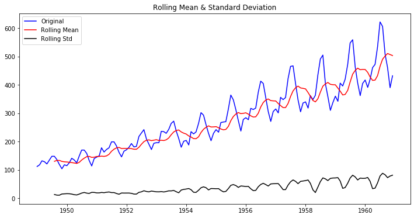
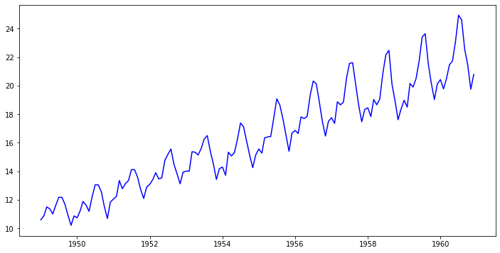
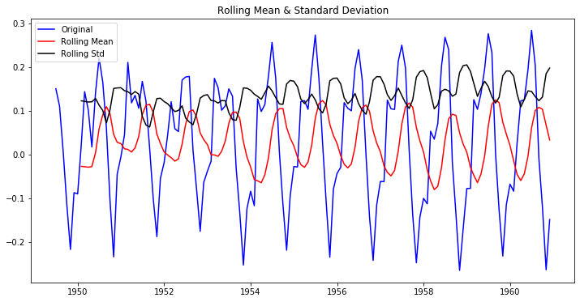
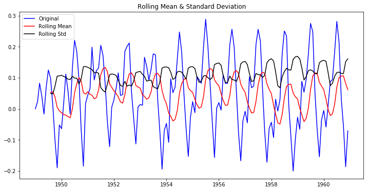
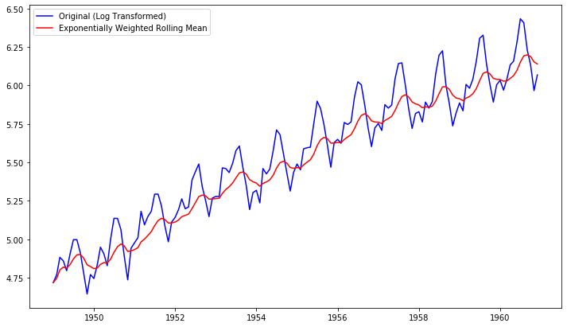
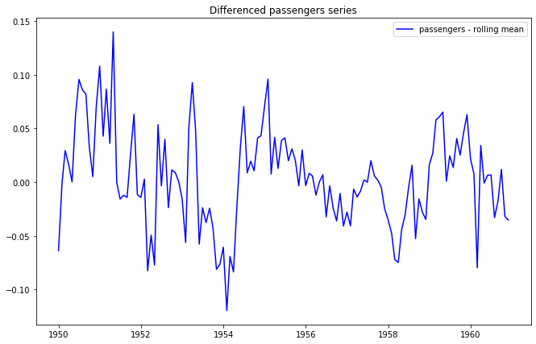
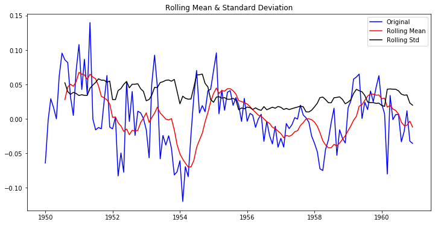

# Removing Trends - Lab

## Introduction

In this lab, you'll practice your detrending skills!

## Objectives

In this lab you will: 

- Use a log transformation to minimize non-stationarity 
- Use rolling means to reduce non-stationarity 
- Use differencing to reduce non-stationarity 
- Use rolling statistics as a check for stationarity 
- Create visualizations of transformed time series as a visual aid to determine if stationarity has been achieved 
- Use the Dickey-Fuller test and conclude whether or not a dataset is exhibiting stationarity 


## Detrending the Air passenger data 

In this lab you will work with the air passenger dataset available in `'passengers.csv'`. First, run the following cell to import the necessary libraries. 


```python
# Import necessary libraries
import pandas as pd
import numpy as np
import matplotlib.pylab as plt
%matplotlib inline
```


```python
# __SOLUTION__ 
# Import necessary libraries
import pandas as pd
import numpy as np
import matplotlib.pylab as plt
%matplotlib inline
```

- Import the `'passengers.csv'` dataset 
- Change the data type of the `'Month'` column to a proper date format 
- Set the `'Month'` column as the index of the DataFrame 
- Print the first five rows of the dataset 


```python
# Import 'passengers.csv' dataset
data = None

# Change the data type of the 'Month' column
data['Month'] = None

# Set the 'Month' column as the index
ts = None

# Print the first five rows

```


```python
# __SOLUTION__ 
# Import 'passengers.csv' dataset
data = pd.read_csv('passengers.csv')

# Change the data type of the 'Month' column
data['Month'] = pd.to_datetime(data['Month'])

# Set the 'Month' column as the index
ts = data.set_index('Month')

# Print the first five rows
ts.head()
```


<div>
<style scoped>
    .dataframe tbody tr th:only-of-type {
        vertical-align: middle;
    }

    .dataframe tbody tr th {
        vertical-align: top;
    }

    .dataframe thead th {
        text-align: right;
    }
</style>
<table border="1" class="dataframe">
  <thead>
    <tr style="text-align: right;">
      <th></th>
      <th>#Passengers</th>
    </tr>
    <tr>
      <th>Month</th>
      <th></th>
    </tr>
  </thead>
  <tbody>
    <tr>
      <th>1949-01-01</th>
      <td>112</td>
    </tr>
    <tr>
      <th>1949-02-01</th>
      <td>118</td>
    </tr>
    <tr>
      <th>1949-03-01</th>
      <td>132</td>
    </tr>
    <tr>
      <th>1949-04-01</th>
      <td>129</td>
    </tr>
    <tr>
      <th>1949-05-01</th>
      <td>121</td>
    </tr>
  </tbody>
</table>
</div>


Plot this time series. 


```python
# Plot the time series

```


```python
# __SOLUTION__ 
# Plot the time series
ts.plot(figsize=(12,6), color='blue');
```


## Create a stationarity check

Your next task is to use the code from previous labs to create a function `stationarity_check()` that takes in a time series and performs stationarity checks including rolling statistics and the Dickey-Fuller test. 

We want the output of the function to: 

- Plot the original time series along with the rolling mean and rolling standard deviation (use a window of 8) in one plot 
- Output the results of the Dickey-Fuller test 


```python
# Create a function to check for the stationarity of a given time series using rolling stats and DF test
# Collect and package the code from previous labs

```


```python
# __SOLUTION__ 
# Create a function to check for the stationarity of a given time series using rolling stats and DF test
# Collect and package the code from previous labs

def stationarity_check(TS):
    
    # Import adfuller
    from statsmodels.tsa.stattools import adfuller
    
    # Calculate rolling statistics
    roll_mean = TS.rolling(window=8, center=False).mean()
    roll_std = TS.rolling(window=8, center=False).std()
    
    # Perform the Dickey Fuller Test
    dftest = adfuller(TS['#Passengers'])
    
    # Plot rolling statistics:
    fig = plt.figure(figsize=(12,6))
    plt.plot(TS, color='blue',label='Original')
    plt.plot(roll_mean, color='red', label='Rolling Mean')
    plt.plot(roll_std, color='black', label = 'Rolling Std')
    plt.legend(loc='best')
    plt.title('Rolling Mean & Standard Deviation')
    plt.show(block=False)
    
    # Print Dickey-Fuller test results
    print('Results of Dickey-Fuller Test: \n')

    dfoutput = pd.Series(dftest[0:4], index=['Test Statistic', 'p-value', 
                                             '#Lags Used', 'Number of Observations Used'])
    for key,value in dftest[4].items():
        dfoutput['Critical Value (%s)'%key] = value
    print(dfoutput)
    
    return None
```

Use your newly created function on the `ts` timeseries. 


```python
# Code here
```


```python
# __SOLUTION__ 
stationarity_check(ts)
```





    Results of Dickey-Fuller Test: 
    
    Test Statistic                   0.815369
    p-value                          0.991880
    #Lags Used                      13.000000
    Number of Observations Used    130.000000
    Critical Value (1%)             -3.481682
    Critical Value (5%)             -2.884042
    Critical Value (10%)            -2.578770
    dtype: float64


## Perform a log and square root transform

Plot a log transform of the original time series (`ts`). 


```python
# Plot a log transform

```


```python
# __SOLUTION__ 
# Plot a log transform
ts_log = np.log(ts)
fig = plt.figure(figsize=(12,6))
plt.plot(ts_log, color='blue');
```


Plot a square root  transform of the original time series (`ts`). 


```python
# Plot a square root transform

```


```python
# __SOLUTION__ 
# Plot a square root transform
ts_sqrt = np.sqrt(ts)
fig = plt.figure(figsize=(12,6))
plt.plot(ts_sqrt, color='blue');
```





Going forward, let's keep working with the log transformed data before subtracting rolling mean, differencing, etc.

## Subtracting the rolling mean

Create a rolling mean using your log transformed time series, with a time window of 7. Plot the log-transformed time series and the rolling mean together.


```python
# your code here
roll_mean = None
fig = plt.figure(figsize=(11,7)) 

```


```python
# __SOLUTION__ 
roll_mean = np.log(ts).rolling(window=7).mean()
fig = plt.figure(figsize=(11,7))
plt.plot(np.log(ts), color='blue', label='Original')
plt.plot(roll_mean, color='red', label='Rolling Mean')
plt.legend(loc='best')
plt.title('Log Transformed Data')
plt.show(block=False)
```





Now, subtract this rolling mean from the log transformed time series, and look at the 10 first elements of the result.  


```python
# Subtract the moving average from the log transformed data
data_minus_roll_mean = None

# Print the first 10 rows

```


```python
# __SOLUTION__ 
# Subtract the moving average from the log transformed data
data_minus_roll_mean = np.log(ts) - roll_mean

# Print the first 10 rows
data_minus_roll_mean.head(10)
```


<div>
<style scoped>
    .dataframe tbody tr th:only-of-type {
        vertical-align: middle;
    }

    .dataframe tbody tr th {
        vertical-align: top;
    }

    .dataframe thead th {
        text-align: right;
    }
</style>
<table border="1" class="dataframe">
  <thead>
    <tr style="text-align: right;">
      <th></th>
      <th>#Passengers</th>
    </tr>
    <tr>
      <th>Month</th>
      <th></th>
    </tr>
  </thead>
  <tbody>
    <tr>
      <th>1949-01-01</th>
      <td>NaN</td>
    </tr>
    <tr>
      <th>1949-02-01</th>
      <td>NaN</td>
    </tr>
    <tr>
      <th>1949-03-01</th>
      <td>NaN</td>
    </tr>
    <tr>
      <th>1949-04-01</th>
      <td>NaN</td>
    </tr>
    <tr>
      <th>1949-05-01</th>
      <td>NaN</td>
    </tr>
    <tr>
      <th>1949-06-01</th>
      <td>NaN</td>
    </tr>
    <tr>
      <th>1949-07-01</th>
      <td>0.150059</td>
    </tr>
    <tr>
      <th>1949-08-01</th>
      <td>0.110242</td>
    </tr>
    <tr>
      <th>1949-09-01</th>
      <td>0.005404</td>
    </tr>
    <tr>
      <th>1949-10-01</th>
      <td>-0.113317</td>
    </tr>
  </tbody>
</table>
</div>


Drop the missing values from this time series. 


```python
# Drop the missing values

```


```python
# __SOLUTION__ 
# Drop the missing values
data_minus_roll_mean.dropna(inplace=True)
```

Plot this time series now. 


```python
# Plot the result

```


```python
# __SOLUTION__ 
fig = plt.figure(figsize=(11,7))
plt.plot(data_minus_roll_mean, color='blue',label='Passengers - rolling mean')
plt.legend(loc='best')
plt.show(block=False)
```





Finally, use your function `check_stationarity()` to see if this series is stationary!


```python
# Your code here
```


```python
# __SOLUTION__ 
stationarity_check(data_minus_roll_mean)
```


    Results of Dickey-Fuller Test: 
    
    Test Statistic                  -2.348027
    p-value                          0.156946
    #Lags Used                      14.000000
    Number of Observations Used    123.000000
    Critical Value (1%)             -3.484667
    Critical Value (5%)             -2.885340
    Critical Value (10%)            -2.579463
    dtype: float64


### Based on the visuals and on the Dickey-Fuller test, what do you conclude?


```python
# Your conclusion here
```


```python
# __SOLUTION__
"""
The time series are not stationary, as the p-value is still substantial 
(0.15 instead of smaller than the typical threshold value 0.05).
"""
```


    '\nThe time series are not stationary, as the p-value is still substantial \n(0.15 instead of smaller than the typical threshold value 0.05).\n'


## Subtracting the weighted rolling mean

Repeat all the above steps to calculate the exponential *weighted* rolling mean with a halflife of 4. Start from the log-transformed data again. Compare the Dickey-Fuller test results. What do you conclude?


```python
# Calculate Weighted Moving Average of log transformed data
exp_roll_mean = None

# Plot the original data with exp weighted average

```


```python
# __SOLUTION__ 
# Calculate Weighted Moving Average of log transformed data
exp_roll_mean = np.log(ts).ewm(halflife=4).mean()

# Plot the original data with exp weighted average
fig = plt.figure(figsize=(12,7))
plt.plot(np.log(ts), color='blue',label='Original (Log Transformed)')
plt.plot(exp_roll_mean, color='red', label='Exponentially Weighted Rolling Mean')
plt.legend(loc='best')
plt.show(block=False)
```





- Subtract this exponential weighted rolling mean from the log transformed data  
- Print the resulting time series 


```python
# Subtract the exponential weighted rolling mean from the original data 
data_minus_exp_roll_mean = None

# Plot the time series

```


```python
# __SOLUTION__ 
# Subtract the moving average from the original data and check head for Nans
data_minus_exp_roll_mean = np.log(ts) - exp_roll_mean

# Plot the time series
fig = plt.figure(figsize=(11,7))
plt.plot(data_minus_exp_roll_mean, color='blue',label='Passengers - weighted rolling mean')
plt.legend(loc='best')
plt.show(block=False)
```


Check for stationarity of `data_minus_exp_roll_mean` using your function. 


```python
# Do a stationarity check
```


```python
# __SOLUTION__ 
stationarity_check(data_minus_exp_roll_mean)
```


    Results of Dickey-Fuller Test: 
    
    Test Statistic                  -3.297250
    p-value                          0.015002
    #Lags Used                      13.000000
    Number of Observations Used    130.000000
    Critical Value (1%)             -3.481682
    Critical Value (5%)             -2.884042
    Critical Value (10%)            -2.578770
    dtype: float64


### Based on the visuals and on the Dickey-Fuller test, what do you conclude?


```python
# Your conclusion here
```


```python
# __SOLUTION__
"""
The p-value of the Dickey-Fuller test <0.05, so this series seems to be stationary according to this test! 
Do note that there is still strong seasonality.
"""
```


    '\nThe p-value of the Dickey-Fuller test <0.05, so this series seems to be stationary according to this test! \nDo note that there is still strong seasonality.\n'


## Differencing

Using exponentially weighted moving averages, we seem to have removed the upward trend, but not the seasonality issue. Now use differencing to remove seasonality. Make sure you use the right amount of `periods`. Start from the log-transformed, exponentially weighted rolling mean-subtracted series.

After you differenced the series, drop the missing values, plot the resulting time series, and then run the `stationarity check()` again.


```python
# Difference your data
data_diff = None

# Drop the missing values


# Check out the first few rows
data_diff.head(15)
```


```python
# __SOLUTION__ 
# Difference your data
data_diff = data_minus_exp_roll_mean.diff(periods=12)

# Drop the missing values
data_diff.dropna(inplace=True)

# Check out the first few rows
data_diff.head(15)
```


<div>
<style scoped>
    .dataframe tbody tr th:only-of-type {
        vertical-align: middle;
    }

    .dataframe tbody tr th {
        vertical-align: top;
    }

    .dataframe thead th {
        text-align: right;
    }
</style>
<table border="1" class="dataframe">
  <thead>
    <tr style="text-align: right;">
      <th></th>
      <th>#Passengers</th>
    </tr>
    <tr>
      <th>Month</th>
      <th></th>
    </tr>
  </thead>
  <tbody>
    <tr>
      <th>1950-01-01</th>
      <td>-0.063907</td>
    </tr>
    <tr>
      <th>1950-02-01</th>
      <td>-0.001185</td>
    </tr>
    <tr>
      <th>1950-03-01</th>
      <td>0.029307</td>
    </tr>
    <tr>
      <th>1950-04-01</th>
      <td>0.016168</td>
    </tr>
    <tr>
      <th>1950-05-01</th>
      <td>0.000194</td>
    </tr>
    <tr>
      <th>1950-06-01</th>
      <td>0.062669</td>
    </tr>
    <tr>
      <th>1950-07-01</th>
      <td>0.095524</td>
    </tr>
    <tr>
      <th>1950-08-01</th>
      <td>0.085827</td>
    </tr>
    <tr>
      <th>1950-09-01</th>
      <td>0.081834</td>
    </tr>
    <tr>
      <th>1950-10-01</th>
      <td>0.032363</td>
    </tr>
    <tr>
      <th>1950-11-01</th>
      <td>0.005065</td>
    </tr>
    <tr>
      <th>1950-12-01</th>
      <td>0.069320</td>
    </tr>
    <tr>
      <th>1951-01-01</th>
      <td>0.107890</td>
    </tr>
    <tr>
      <th>1951-02-01</th>
      <td>0.042702</td>
    </tr>
    <tr>
      <th>1951-03-01</th>
      <td>0.086617</td>
    </tr>
  </tbody>
</table>
</div>


Plot the resulting differenced time series. 


```python
# Plot your differenced time series

```


```python
# __SOLUTION__ 
fig = plt.figure(figsize=(11,7))
plt.plot(data_diff, color='blue',label='passengers - rolling mean')
plt.legend(loc='best')
plt.title('Differenced passengers series')
plt.show(block=False)
```





```python
# Perform the stationarity check
```


```python
# __SOLUTION__ 
stationarity_check(data_diff)
```





    Results of Dickey-Fuller Test: 
    
    Test Statistic                  -3.601666
    p-value                          0.005729
    #Lags Used                      12.000000
    Number of Observations Used    119.000000
    Critical Value (1%)             -3.486535
    Critical Value (5%)             -2.886151
    Critical Value (10%)            -2.579896
    dtype: float64


### Your conclusion


```python
# Your conclusion here
```


```python
# __SOLUTION__
"""
Even though the rolling mean and rolling average lines do seem to be fluctuating, the movements seem to be completely random, 
and the same conclusion holds for the original time series. Your time series is now ready for modeling!
"""
```


    '\nEven though the rolling mean and rolling average lines do seem to be fluctuating, the movements seem to be completely random, \nand the same conclusion holds for the original time series. \nYour time series is now ready for modeling!\n'


## Summary 

In this lab, you learned how to make time series stationary through using log transforms, rolling means, and differencing.
