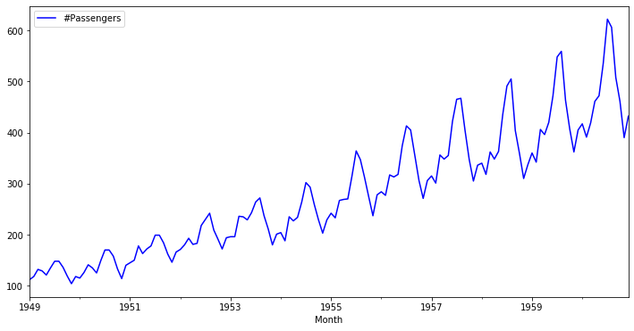
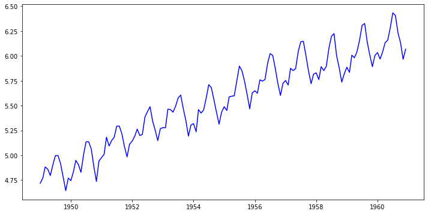
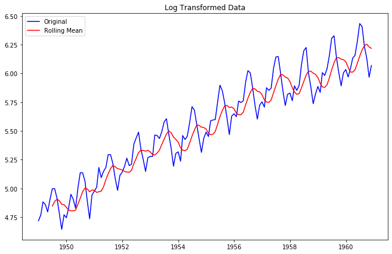
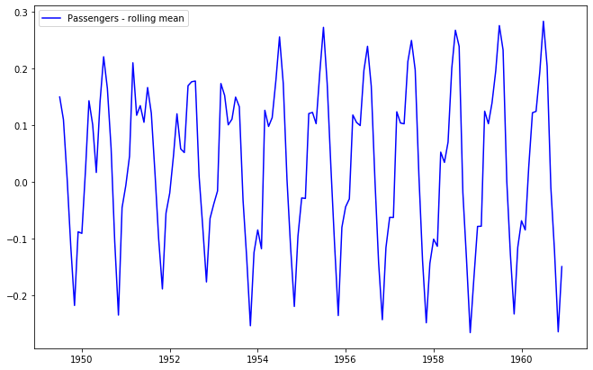
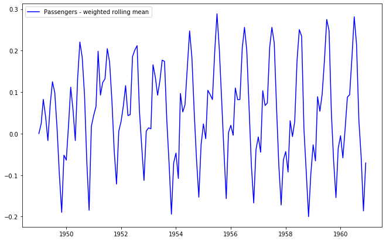

# Removing Trends - Lab

## Introduction

In this lab, you'll practice your detrending skills!

## Objectives

You will be able to:
* Learn how to remove trends and seasonality
* Use a log transformation to minimize non-stationarity
* Use rolling means to reduce non-stationarity
* Use differencing to reduce non-stationarity

## Detrending the Airpassenger data


```python
#Import necessary libraries
import pandas as pd
from pandas import Series
import numpy as np

import matplotlib.pylab as plt
%matplotlib inline

# Import passengers.csv and set it as a time-series object. Plot the TS
data = pd.read_csv('passengers.csv')
ts = data.set_index('Month')
ts.index = pd.to_datetime(ts.index)
ts.plot(figsize=(12,6), color="blue");
```


## Create a stationarity check

At this stage, we can use the code from previous labs to create a function `stationarity_check(ts)` that takes in a time series object and performs stationarity checks including rolling statistics and the Dickey Fuller test. 

We want the output of the function to:
- Plot the original time series along with the rolling mean and rolling standard deviation in one plot
- Output the results of the Dickey-Fuller test


```python
# Create a function to check for the stationarity of a given timeseries using rolling stats and DF test
# Collect and package the code from previous lab

def stationarity_check(TS):
    
    # Import adfuller
    from statsmodels.tsa.stattools import adfuller
    
    # Calculate rolling statistics
    rolmean = TS.rolling(window = 8, center = False).mean()
    rolstd = TS.rolling(window = 8, center = False).std()
    
    # Perform the Dickey Fuller Test
    dftest = adfuller(TS['#Passengers']) # change the passengers column as required 
    
    #Plot rolling statistics:
    fig = plt.figure(figsize=(12,6))
    orig = plt.plot(TS, color='blue',label='Original')
    mean = plt.plot(rolmean, color='red', label='Rolling Mean')
    std = plt.plot(rolstd, color='black', label = 'Rolling Std')
    plt.legend(loc='best')
    plt.title('Rolling Mean & Standard Deviation')
    plt.show(block=False)
    
    # Print Dickey-Fuller test results
    print ('Results of Dickey-Fuller Test:')

    dfoutput = pd.Series(dftest[0:4], index=['Test Statistic','p-value','#Lags Used','Number of Observations Used'])
    for key,value in dftest[4].items():
        dfoutput['Critical Value (%s)'%key] = value
    print (dfoutput)
    
    return None
```

Use your newly created function on the airpassenger data set.


```python
stationarity_check(ts)
```





    Results of Dickey-Fuller Test:
    Test Statistic                   0.815369
    p-value                          0.991880
    #Lags Used                      13.000000
    Number of Observations Used    130.000000
    Critical Value (1%)             -3.481682
    Critical Value (5%)             -2.884042
    Critical Value (10%)            -2.578770
    dtype: float64


## Perform a log() and sqrt() transform


```python
# Log transform timeseries and compare with original to check the effect
ts_log = np.log(ts)
ts_sqrt= np.sqrt(ts)
fig = plt.figure(figsize=(12,6))
plt.plot(ts,  color='blue');
plt.show()
fig = plt.figure(figsize=(12,6))
plt.plot(ts_log, color='blue');
plt.show()
fig = plt.figure(figsize=(12,6))
plt.plot(ts_sqrt, color='blue');
```


moving forward, let's keep working with the log transformed data before subtracting rolling mean, differencing, etc.

## Subtracting the rolling mean

Create a rolling mean using your log transformed time series, with a time window of 7. Plot the log-transformed time series and the rolling mean together.


```python
rolmean = np.log(ts).rolling(window = 7).mean()
fig = plt.figure(figsize=(11,7))
orig = plt.plot(np.log(ts), color='blue',label='Original')
mean = plt.plot(rolmean, color='red', label='Rolling Mean')
plt.legend(loc='best')
plt.title('Rolling Mean & Standard Deviation')
plt.show(block=False)
```





Now, subtract the rolling mean from the time series, look at the 10 first elements of the result and plot the result.


```python
# Subtract the moving average from the original data and check head for Nans
data_minus_rolmean = np.log(ts) - rolmean
data_minus_rolmean.head(10)
```


<div>
<style scoped>
    .dataframe tbody tr th:only-of-type {
        vertical-align: middle;
    }

    .dataframe tbody tr th {
        vertical-align: top;
    }

    .dataframe thead th {
        text-align: right;
    }
</style>
<table border="1" class="dataframe">
  <thead>
    <tr style="text-align: right;">
      <th></th>
      <th>#Passengers</th>
    </tr>
    <tr>
      <th>Month</th>
      <th></th>
    </tr>
  </thead>
  <tbody>
    <tr>
      <th>1949-01-01</th>
      <td>NaN</td>
    </tr>
    <tr>
      <th>1949-02-01</th>
      <td>NaN</td>
    </tr>
    <tr>
      <th>1949-03-01</th>
      <td>NaN</td>
    </tr>
    <tr>
      <th>1949-04-01</th>
      <td>NaN</td>
    </tr>
    <tr>
      <th>1949-05-01</th>
      <td>NaN</td>
    </tr>
    <tr>
      <th>1949-06-01</th>
      <td>NaN</td>
    </tr>
    <tr>
      <th>1949-07-01</th>
      <td>0.150059</td>
    </tr>
    <tr>
      <th>1949-08-01</th>
      <td>0.110242</td>
    </tr>
    <tr>
      <th>1949-09-01</th>
      <td>0.005404</td>
    </tr>
    <tr>
      <th>1949-10-01</th>
      <td>-0.113317</td>
    </tr>
  </tbody>
</table>
</div>


```python
# Drop the NaN values from timeseries calculated above
data_minus_rolmean.dropna(inplace=True)
```


```python
fig = plt.figure(figsize=(11,7))
plt.plot(data_minus_rolmean, color='blue',label='Passengers - rolling mean')
plt.legend(loc='best')
plt.title('Passengers while the rolling mean is subtracted')
plt.show(block=False)
```


Finally, use your function `check_stationarity` to see if this series is considered stationary!


```python
stationarity_check(data_minus_rolmean)
```





    Results of Dickey-Fuller Test:
    Test Statistic                  -2.348027
    p-value                          0.156946
    #Lags Used                      14.000000
    Number of Observations Used    123.000000
    Critical Value (1%)             -3.484667
    Critical Value (5%)             -2.885340
    Critical Value (10%)            -2.579463
    dtype: float64


### Based on the visuals and on the Dickey-Fuller test, what do you conclude?


```python
"""
The time series are not stationary, as the p-value is still substantial 
(0.15 instead of smaller than the typical threshold value 0.05).
"""
```

## Subtracting the weighted rolling mean

Repeat all the above for the *weighter* rolling mean. Start from the log-transformed data again. Compare the Dickey-Fuller Test results. What do you conclude?


```python
# Use Pandas ewma() to calculate Weighted Moving Average of ts_log
exp_rolmean = np.log(ts).ewm(halflife = 4).mean()

# Plot the original data with exp weighted average
fig = plt.figure(figsize=(12,7))
orig = plt.plot(np.log(ts), color='blue',label='Original')
mean = plt.plot(exp_rolmean, color='red', label='Exponentially Weighted Rolling Mean')
plt.legend(loc='best')
plt.title('Exponentially Weighted Rolling Mean & Standard Deviation')
plt.show(block=False)
```


```python
# Subtract the moving average from the original data and check head for Nans
data_minus_exp_rolmean = np.log(ts) - exp_rolmean
data_minus_exp_rolmean.head(15)

fig = plt.figure(figsize=(11,7))
plt.plot(data_minus_exp_rolmean, color='blue',label='Passengers - weighted rolling mean')
plt.legend(loc='best')
plt.title('Passengers while the weighted rolling mean is subtracted')
plt.show(block=False)
```





```python
stationarity_check(data_minus_exp_rolmean)
```


    Results of Dickey-Fuller Test:
    Test Statistic                  -3.297250
    p-value                          0.015002
    #Lags Used                      13.000000
    Number of Observations Used    130.000000
    Critical Value (1%)             -3.481682
    Critical Value (5%)             -2.884042
    Critical Value (10%)            -2.578770
    dtype: float64


### Based on the visuals and on the Dickey-Fuller test, what do you conclude?


```python
"""
The p-value of the Dickey-Fuller test <0.05, so this series seems to be stationary according to this test! 
Do note that there is still strong seasonality.
"""
```

## Differencing

Using exponentially weighted moving averages, we seem to have removed the upward trend, but not the seasonality issue. Now use differencing to remove seasonality. Make sure you use the right amount of `periods`. Start from the log-transformed, exponentially weighted rolling mean-subtracted series.

After you differenced the series, run the `stationarity check` again.


```python
data_diff = data_minus_exp_rolmean.diff(periods=12)
data_diff.head(15)
```


<div>
<style scoped>
    .dataframe tbody tr th:only-of-type {
        vertical-align: middle;
    }

    .dataframe tbody tr th {
        vertical-align: top;
    }

    .dataframe thead th {
        text-align: right;
    }
</style>
<table border="1" class="dataframe">
  <thead>
    <tr style="text-align: right;">
      <th></th>
      <th>#Passengers</th>
    </tr>
    <tr>
      <th>Month</th>
      <th></th>
    </tr>
  </thead>
  <tbody>
    <tr>
      <th>1949-01-01</th>
      <td>NaN</td>
    </tr>
    <tr>
      <th>1949-02-01</th>
      <td>NaN</td>
    </tr>
    <tr>
      <th>1949-03-01</th>
      <td>NaN</td>
    </tr>
    <tr>
      <th>1949-04-01</th>
      <td>NaN</td>
    </tr>
    <tr>
      <th>1949-05-01</th>
      <td>NaN</td>
    </tr>
    <tr>
      <th>1949-06-01</th>
      <td>NaN</td>
    </tr>
    <tr>
      <th>1949-07-01</th>
      <td>NaN</td>
    </tr>
    <tr>
      <th>1949-08-01</th>
      <td>NaN</td>
    </tr>
    <tr>
      <th>1949-09-01</th>
      <td>NaN</td>
    </tr>
    <tr>
      <th>1949-10-01</th>
      <td>NaN</td>
    </tr>
    <tr>
      <th>1949-11-01</th>
      <td>NaN</td>
    </tr>
    <tr>
      <th>1949-12-01</th>
      <td>NaN</td>
    </tr>
    <tr>
      <th>1950-01-01</th>
      <td>-0.063907</td>
    </tr>
    <tr>
      <th>1950-02-01</th>
      <td>-0.001185</td>
    </tr>
    <tr>
      <th>1950-03-01</th>
      <td>0.029307</td>
    </tr>
  </tbody>
</table>
</div>


```python
fig = plt.figure(figsize=(11,7))
plt.plot(data_diff, color='blue',label='passengers - rolling mean')
plt.legend(loc='best')
plt.title('Differenced passengers series')
plt.show(block=False)
```


```python
data_diff.dropna(inplace=True)
```


```python
stationarity_check(data_diff)
```





    Results of Dickey-Fuller Test:
    Test Statistic                  -3.601666
    p-value                          0.005729
    #Lags Used                      12.000000
    Number of Observations Used    119.000000
    Critical Value (1%)             -3.486535
    Critical Value (5%)             -2.886151
    Critical Value (10%)            -2.579896
    dtype: float64


### Your conclusion


```python
"""
Even though the rolling mean and rolling average lines do seem to be fluctuating, the movements seem to be completely random, 
and the same conclusion holds for the original time series. 
Your time series is now ready for modeling!
"""
```

## Summary 

In this lab, you learned how to make time series stationary through using log transforms, rolling means and differencing.
